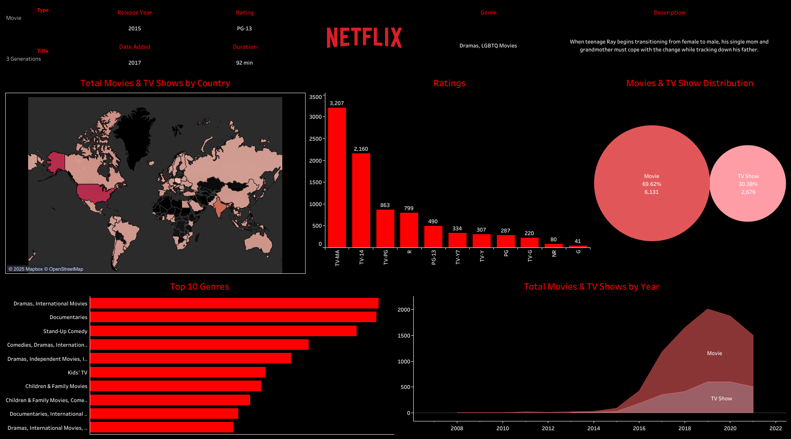

# Netflix-Movie-TV-Shows-Dashboard

This project is a data visualization dashboard built using **Tableau Public** to explore and analyze Netflix's content library. The dashboard provides interactive insights into the types, ratings, genres, and distribution of movies and TV shows available on Netflix globally.

---

## 🚀 Overview

The Netflix Dashboard allows users to:
- Analyze **total movies and TV shows** by **country**
- Explore **top 10 genres**
- Visualize the **distribution of content** type (Movies vs. TV Shows)
- Understand **ratings** distribution
- Track **content release trends** over the years
- View detailed metadata for selected shows and movies

---

## 📂 Dataset

- **Name**: Netflix Titles Dataset  
- **Source**: [Kaggle - Netflix Movies and TV Shows](https://www.kaggle.com/datasets/padmapriyatr/netflix-titles)  
- **Fields**: Title, Type, Release Year, Rating, Genre, Country, Duration, etc.

---

## 📌 Key Visuals

- 🌍 **Map** of total shows/movies by country  
- 📊 **Bar chart** of top genres  
- 🍿 **Rating-wise** and **year-wise** distributions  
- 🎥 Genre and Type-specific insights

---

## 📷 Dashboard Preview

---

## Key Insights
1. **Content Type Distribution**: Movies dominate Netflix’s catalog, comprising approximately 69.62% of the total content, while TV shows make up the remaining 30.38%.
2. **Top Ratings**: The most common content rating is 'TV-MA' with over 3,200 titles, followed by 'TV-14' and 'TV-PG'. This suggests that a significant portion of Netflix content is geared toward mature audiences.
3. **Top Genres**: The leading genres include Dramas, Documentaries, and Stand-Up Comedy. International content, especially dramas and comedies, are well-represented in the top 10.
4. **Geographical Distribution**: The United States leads in the number of movies and TV shows available, followed by other English-speaking and major international markets.
5. **Content Over Time**: The release of content surged post-2015, peaking around 2018–2020. Movies consistently outnumber TV shows each year.
6. **Genre Diversity**: The genres exhibit a strong presence of family-oriented content such as Kids’ TV and Children & Family Movies, reflecting Netflix’s strategy to target broader audiences.

## 🔗 View Live Dashboard

👉 **[Click here to view on Tableau Public](https://public.tableau.com/views/NetflixDashboard_17441711569640/Netflix?:language=en-US&:sid=&:redirect=auth&:display_count=n&:origin=viz_share_link)**

---

## 📜 License

This project is open-source and available under the [MIT License](LICENSE).
